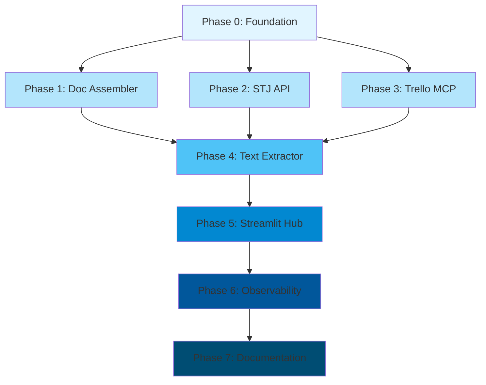

# Legal Workbench - Docker Implementation Plan
## Microservices Architecture (Option B)

**Version**: 1.0
**Created**: 2025-12-11
**Status**: Draft
**Estimated Total Duration**: 18-22 working days
**Target Environment**: 14GB RAM (WSL), i5 12th gen (6 cores (3 no WSL)), 260GB SSD NVMe, WSL2

---

## 1. Resumo

Este plano detalha a transformação do Legal Workbench de uma aplicação Streamlit monolítica para uma arquitetura de microserviços usando Docker e Docker Compose. O sistema atual consiste em um hub Streamlit que importa diretamente módulos Python de cinco ferramentas backend. A arquitetura alvo irá containerizar cada componente como um serviço independente com APIs REST, permitindo escalabilidade, deploys isolados e melhor tolerância a falhas.

**Objetivos Principais**:
- Zero degradação de funcionalidade durante migração
- Confiável desde o dia um (logging, health checks)
- Rollout gradual com capacidade de rollback em cada fase
- Preservar toda a complexidade existente (Marker OCR, Gemini API, DuckDB, MCP Server)

**Architecture Shift**:
```
BEFORE: Streamlit App -> Direct Python Imports -> Tool Logic
AFTER:  Streamlit App -> REST APIs -> Dockerized Services
```

---

## 2. Architecture Overview

### 2.1 System Components

The system will consist of 6 containerized services:

```
┌─────────────────────────────────────────────────────────────────┐
│                     Docker Compose Network                       │
│                      (legal-workbench-net)                       │
├─────────────────────────────────────────────────────────────────┤
│                                                                   │
│  ┌────────────────┐          API Gateway Layer                   │
│  │  Streamlit Hub │ ◄────────────────────────────────────┐      │
│  │  (Port 8501)   │                                       │      │
│  └────────┬───────┘                                       │      │
│           │                                                │      │
│           ├──► http://text-extractor:8001/api/v1          │      │
│           ├──► http://doc-assembler:8002/api/v1           │      │
│           ├──► http://stj-api:8003/api/v1                 │      │
│           ├──► http://trello-mcp:8004/api/v1              │      │
│           └──► http://prometheus:9090 (metrics)           │      │
│                                                            │      │
│  ┌──────────────────────────────────────────────────┐     │      │
│  │ Service Layer (FastAPI-based APIs)              │     │      │
│  ├──────────────────────────────────────────────────┤     │      │
│  │                                                  │     │      │
│  │  ┌─────────────────┐  ┌──────────────────┐     │     │      │
│  │  │ Text Extractor  │  │ Doc Assembler    │     │     │      │
│  │  │ - Marker PDF    │  │ - Jinja2 Engine  │     │     │      │
│  │  │ - Gemini API    │  │ - DOCX Generator │     │     │      │
│  │  │ RAM: 12GB       │  │ RAM: 1GB         │     │     │      │
│  │  └─────────────────┘  └──────────────────┘     │     │      │
│  │                                                  │     │      │
│  │  ┌─────────────────┐  ┌──────────────────┐     │     │      │
│  │  │ STJ API         │  │ Trello MCP       │     │     │      │
│  │  │ - DuckDB        │  │ - MCP Protocol   │     │     │      │
│  │  │ - REST Client   │  │ - Trello API     │     │     │      │
│  │  │ RAM: 2GB        │  │ RAM: 512MB       │     │     │      │
│  │  └─────────────────┘  └──────────────────┘     │     │      │
│  │                                                  │     │      │
│  └──────────────────────────────────────────────────┘     │      │
│                                                            │      │
│  ┌──────────────────────────────────────────────────┐     │      │
│  │ Observability Layer                              │     │      │
│  ├──────────────────────────────────────────────────┤     │      │
│  │  Basic Logging (docker logs + health checks)     │     │      │
│  └──────────────────────────────────────────────────┘     │      │
│                                                            │      │
│  ┌──────────────────────────────────────────────────┐     │      │
│  │ Storage Layer (Docker Volumes)                   │     │      │
│  ├──────────────────────────────────────────────────┤     │      │
│  │  - stj-duckdb-data     (DuckDB files)            │     │      │
│  │  - text-extractor-cache (Marker cache)           │     │      │
│  │  - app-data            (Shared data)             │     │      │
│  └──────────────────────────────────────────────────┘     │      │
│                                                            │      │
└────────────────────────────────────────────────────────────┘      │
                                                                     │
External Dependencies:                                              │
  - Gemini API (text-extractor)                                    │
  - Trello API (trello-mcp)                                        │
  - STJ Open Data API (stj-api)                                    │
```

### 2.2 Communication Patterns

- **Synchronous**: REST APIs (FastAPI) for CRUD operations
- **Asynchronous**: Background jobs para tarefas longas (text extraction)
- **Service Discovery**: Resolução DNS do Docker (service names)
- **API Versioning**: Prefixo `/api/v1` para todos os endpoints

---

## 3. Definição dos Serviços

### 3.1 Streamlit Hub Service (`streamlit-hub`)

**Responsibility**: Frontend orchestrator and user interface

**Technology Stack**:
- Base Image: `python:3.11-slim`
- Framework: Streamlit 1.40+
- Port: 8501

**Key Features**:
- Dynamic module loading (refactored for API calls)
- Session state management
- API client library for backend services
- Health check dashboard

**Environment Variables**:
```env
TEXT_EXTRACTOR_URL=http://text-extractor:8001
DOC_ASSEMBLER_URL=http://doc-assembler:8002
STJ_API_URL=http://stj-api:8003
TRELLO_MCP_URL=http://trello-mcp:8004
DATA_PATH=/app/data
```

---

### 3.2 Text Extractor Service (`text-extractor`)

**Responsibility**: PDF text extraction with OCR and AI post-processing

**Technology Stack**:
- Base Image: `python:3.11-slim` (multi-stage build)
- Framework: FastAPI + Celery (for async jobs)
- ML Libraries: Marker PDF, Pillow, pdfplumber
- External API: Google Gemini API

**Resource Requirements**:
- RAM: 10GB limit (Marker PDF models + processing buffer)
- CPU: 4 cores recommended
- Disk: 20GB (model cache + temp files)

**API Endpoints**:
```
POST /api/v1/extract              # Start extraction job
GET  /api/v1/jobs/{job_id}        # Poll job status
GET  /api/v1/jobs/{job_id}/result # Retrieve result
GET  /api/v1/health               # Service health
```

**Environment Variables**:
```env
GEMINI_API_KEY=<secret>
MARKER_CACHE_DIR=/app/cache
MAX_CONCURRENT_JOBS=2
JOB_TIMEOUT_SECONDS=600
```

**Volume Mounts**:
- `/app/cache` - Marker model cache (persistent)
- `/app/uploads` - Temporary PDF uploads
- `/app/data` - Shared data with hub

---

### 3.3 Document Assembler Service (`doc-assembler`)

**Responsibility**: Generate legal documents from JSON templates

**Technology Stack**:
- Base Image: `python:3.11-slim`
- Framework: FastAPI
- Template Engine: Jinja2 + python-docx

**Resource Requirements**:
- RAM: 1GB
- CPU: 1 core
- Disk: 2GB (template storage)

**API Endpoints**:
```
POST /api/v1/assemble             # Generate document
GET  /api/v1/templates            # List available templates
GET  /api/v1/templates/{id}       # Get template details
POST /api/v1/templates/validate   # Validate JSON data
GET  /api/v1/health
```

**Environment Variables**:
```env
TEMPLATES_DIR=/app/templates
OUTPUT_DIR=/app/output
MAX_TEMPLATE_SIZE_MB=10
```

**Volume Mounts**:
- `/app/templates` - Document templates
- `/app/output` - Generated documents (temporary)

---

### 3.4 STJ Open Data Service (`stj-api`)

**Responsibility**: Query and cache STJ (Superior Tribunal de Justiça) legal data

**Technology Stack**:
- Base Image: `python:3.11-slim`
- Framework: FastAPI
- Database: DuckDB (embedded, file-based)
- HTTP Client: httpx with retry logic

**Resource Requirements**:
- RAM: 2GB
- CPU: 2 cores
- Disk: 10GB (DuckDB files)

**API Endpoints**:
```
GET  /api/v1/search               # Search jurisprudence
GET  /api/v1/case/{id}            # Get case details
POST /api/v1/sync                 # Force data sync
GET  /api/v1/stats                # Database statistics
GET  /api/v1/health
```

**Environment Variables**:
```env
DUCKDB_PATH=/app/data/stj.duckdb
STJ_API_BASE_URL=https://api.stj.jus.br
CACHE_TTL_HOURS=24
SYNC_INTERVAL_HOURS=6
```

**Volume Mounts**:
- `/app/data` - DuckDB database files (persistent)

---

### 3.5 Trello MCP Service (`trello-mcp`)

**Responsibility**: MCP-compliant interface to Trello API

**Technology Stack**:
- Base Image: `python:3.11-slim`
- Framework: FastAPI + MCP Python SDK
- External API: Trello REST API

**Resource Requirements**:
- RAM: 512MB
- CPU: 1 core
- Disk: 500MB

**API Endpoints**:
```
POST /api/v1/mcp/tools/call       # Execute MCP tool
GET  /api/v1/mcp/tools/list       # List available tools
POST /api/v1/cards                # Create Trello card
GET  /api/v1/boards               # List boards
GET  /api/v1/health
```

**Environment Variables**:
```env
TRELLO_API_KEY=<secret>
TRELLO_API_TOKEN=<secret>
TRELLO_DEFAULT_BOARD_ID=<id>
RATE_LIMIT_PER_MINUTE=100
```

---

### 3.6 Logging e Monitoramento

**Docker Logs** (logging básico):
- Todos os serviços usam stdout/stderr
- Logs acessíveis via `docker-compose logs`
- Rotação configurada (max-size, max-file)

**Health Checks** (disponibilidade):
- Todos os serviços expõem `/health` endpoint
- Docker monitora automaticamente
- Restart automático se unhealthy

---

## 4. API Contracts

### 4.1 Text Extractor API

#### POST /api/v1/extract
**Description**: Start PDF text extraction job

**Request Body**:
```json
{
  "file": "base64_encoded_pdf_content",
  "filename": "contrato.pdf",
  "engine": "marker",  // "marker" | "pdfplumber"
  "use_gemini": true,
  "options": {
    "extract_images": false,
    "clean_headers_footers": true
  }
}
```

**Success Response** (202 Accepted):
```json
{
  "job_id": "550e8400-e29b-41d4-a716-446655440000",
  "status": "processing",
  "created_at": "2025-12-11T10:30:00Z",
  "estimated_completion": "2025-12-11T10:35:00Z"
}
```

**Error Response** (400 Bad Request):
```json
{
  "error": "invalid_file",
  "message": "File exceeds maximum size of 50MB",
  "details": {
    "max_size_mb": 50,
    "uploaded_size_mb": 75
  }
}
```

#### GET /api/v1/jobs/{job_id}
**Success Response** (200 OK):
```json
{
  "job_id": "550e8400-e29b-41d4-a716-446655440000",
  "status": "completed",  // "queued" | "processing" | "completed" | "failed"
  "progress": 100,
  "created_at": "2025-12-11T10:30:00Z",
  "completed_at": "2025-12-11T10:34:23Z",
  "result_url": "/api/v1/jobs/550e8400-e29b-41d4-a716-446655440000/result"
}
```

---

### 4.2 Document Assembler API

#### POST /api/v1/assemble
**Description**: Generate legal document from template

**Request Body**:
```json
{
  "template_id": "peticao_inicial",
  "data": {
    "autor": {
      "nome": "João da Silva",
      "cpf": "123.456.789-00",
      "endereco": "Rua A, 123"
    },
    "reu": {
      "nome": "Empresa XYZ Ltda",
      "cnpj": "12.345.678/0001-90"
    },
    "valores": {
      "causa": "50000.00",
      "danos_morais": "20000.00"
    }
  },
  "output_format": "docx"  // "docx" | "pdf"
}
```

**Success Response** (200 OK):
```json
{
  "document_id": "doc-20251211-103456",
  "filename": "peticao_inicial_20251211.docx",
  "download_url": "/api/v1/documents/doc-20251211-103456/download",
  "expires_at": "2025-12-11T22:00:00Z",
  "metadata": {
    "pages": 12,
    "template_version": "2.1.0",
    "generated_at": "2025-12-11T10:34:56Z"
  }
}
```

**Error Response** (422 Unprocessable Entity):
```json
{
  "error": "validation_failed",
  "message": "Required field 'autor.cpf' is missing",
  "validation_errors": [
    {
      "field": "autor.cpf",
      "error": "required",
      "message": "CPF is required for initial petition template"
    }
  ]
}
```

---

### 4.3 STJ API

#### GET /api/v1/search
**Description**: Search STJ jurisprudence

**Query Parameters**:
- `q` (string): Search query
- `start_date` (date): Filter by date range
- `end_date` (date): Filter by date range
- `limit` (int): Max results (default: 20, max: 100)
- `offset` (int): Pagination offset

**Success Response** (200 OK):
```json
{
  "results": [
    {
      "id": "REsp 1234567",
      "title": "Recurso Especial - Direito Civil",
      "summary": "Discussão sobre...",
      "date": "2025-11-15",
      "url": "https://stj.jus.br/...",
      "relevance_score": 0.95
    }
  ],
  "total": 156,
  "limit": 20,
  "offset": 0,
  "query_time_ms": 45
}
```

---

### 4.4 Trello MCP API

#### POST /api/v1/cards
**Description**: Create Trello card via MCP protocol

**Request Body**:
```json
{
  "board_id": "abc123",
  "list_id": "def456",
  "name": "Revisar contrato cliente X",
  "description": "Prazo: 15/12/2025\nPrioridade: Alta",
  "labels": ["urgente", "contratos"],
  "due_date": "2025-12-15T18:00:00Z"
}
```

**Success Response** (201 Created):
```json
{
  "card_id": "ghi789",
  "url": "https://trello.com/c/ghi789",
  "short_url": "https://trello.com/c/ghi789",
  "created_at": "2025-12-11T10:35:00Z"
}
```

---

## 5. Data Schema

### 5.1 DuckDB Schema (STJ Service)

```sql
-- Main jurisprudence table
CREATE TABLE jurisprudence (
    id VARCHAR PRIMARY KEY,
    court VARCHAR NOT NULL,  -- 'STJ', 'STF', etc.
    type VARCHAR NOT NULL,   -- 'REsp', 'AgInt', 'HC', etc.
    number INTEGER NOT NULL,
    year INTEGER NOT NULL,

    -- Metadata
    filing_date DATE,
    judgment_date DATE,
    publication_date DATE,

    -- Content
    title TEXT,
    summary TEXT,
    full_text TEXT,
    decision TEXT,

    -- Classification
    subject VARCHAR,
    keywords TEXT[],
    legal_area VARCHAR,

    -- Indexing
    created_at TIMESTAMP DEFAULT CURRENT_TIMESTAMP,
    updated_at TIMESTAMP DEFAULT CURRENT_TIMESTAMP,

    -- Full-text search index
    CONSTRAINT unique_case UNIQUE (court, type, number, year)
);

CREATE INDEX idx_judgment_date ON jurisprudence(judgment_date);
CREATE INDEX idx_subject ON jurisprudence(subject);
CREATE INDEX idx_keywords ON jurisprudence USING GIN(keywords);

-- Cache table for API responses
CREATE TABLE api_cache (
    cache_key VARCHAR PRIMARY KEY,
    response_data JSON NOT NULL,
    created_at TIMESTAMP DEFAULT CURRENT_TIMESTAMP,
    expires_at TIMESTAMP NOT NULL
);

CREATE INDEX idx_cache_expiry ON api_cache(expires_at);

-- Statistics table
CREATE TABLE sync_stats (
    id INTEGER PRIMARY KEY,
    sync_started_at TIMESTAMP,
    sync_completed_at TIMESTAMP,
    records_fetched INTEGER,
    records_updated INTEGER,
    errors_count INTEGER,
    status VARCHAR  -- 'running', 'completed', 'failed'
);
```

### 5.2 Job Queue Schema (Text Extractor - SQLite)

```sql
CREATE TABLE extraction_jobs (
    job_id VARCHAR PRIMARY KEY,
    filename VARCHAR NOT NULL,
    file_hash VARCHAR NOT NULL,
    file_size_bytes INTEGER,

    -- Job config
    engine VARCHAR NOT NULL,  -- 'marker' | 'pdfplumber'
    use_gemini BOOLEAN DEFAULT false,
    options JSON,

    -- Status tracking
    status VARCHAR NOT NULL,  -- 'queued' | 'processing' | 'completed' | 'failed'
    progress INTEGER DEFAULT 0,

    -- Timing
    created_at TIMESTAMP DEFAULT CURRENT_TIMESTAMP,
    started_at TIMESTAMP,
    completed_at TIMESTAMP,

    -- Results
    result_path VARCHAR,
    error_message TEXT,

    -- Metrics
    pages_processed INTEGER,
    execution_time_seconds REAL,
    gemini_tokens_used INTEGER
);

CREATE INDEX idx_status ON extraction_jobs(status);
CREATE INDEX idx_created_at ON extraction_jobs(created_at);
```

---

## 6. Technology Stack Rationale

### 6.1 Container Orchestration: Docker Compose

**Choice**: Docker Compose (development) → Kubernetes (future production)

**Justification**:
- **Simplicity**: Docker Compose provides declarative YAML configuration suitable for local development and small deployments
- **Portability**: Identical environment across dev/staging/production
- **Service Discovery**: Built-in DNS resolution between containers
- **Volume Management**: Persistent data without external orchestration

**Trade-offs vs. Kubernetes**:
| Factor | Docker Compose | Kubernetes |
|--------|---------------|------------|
| Learning curve | Low | High |
| Setup time | Minutes | Hours/Days |
| Auto-scaling | No | Yes |
| Self-healing | Limited | Advanced |
| Multi-host | No | Yes |

**Decision**: Start with Compose, migrate to K8s when traffic exceeds single-host capacity (estimated at 100+ concurrent users).

---

### 6.2 API Framework: FastAPI

**Choice**: FastAPI over Flask/Django

**Justification**:
- **Performance**: ASGI-based, 3x faster than Flask in benchmarks
- **Type Safety**: Pydantic integration for automatic request/response validation
- **OpenAPI**: Auto-generated API documentation (Swagger UI)
- **Async Support**: Native async/await for I/O-bound operations (critical for Gemini/Trello APIs)

**Trade-offs vs. Flask**:
| Factor | FastAPI | Flask |
|--------|---------|-------|
| Speed | High (async) | Moderate (WSGI) |
| Type safety | Built-in (Pydantic) | Manual |
| Documentation | Auto-generated | Manual (Swagger extensions) |
| Ecosystem | Growing | Mature |

**Decision**: FastAPI's native async and validation align with our external API dependencies and production quality requirements.

---

### 6.3 Base Image: python:3.11-slim

**Choice**: `python:3.11-slim` over Alpine or full Python image

**Justification**:
- **Compatibility**: Better support for binary wheels (Marker PDF, Pillow) vs. Alpine's musl libc
- **Size**: 120MB base (vs. 1GB for full image, 50MB for Alpine)
- **Build Time**: Faster pip installs due to pre-compiled wheels

**Trade-offs vs. Alpine**:
| Factor | python:3.11-slim | Alpine |
|--------|------------------|--------|
| Image size | 120MB | 50MB |
| Build time | Fast (wheels) | Slow (compile) |
| Compatibility | High | Medium (musl issues) |
| Security | Good | Excellent |

**Decision**: Compatibility trumps 70MB size difference. Will implement multi-stage builds to minimize final image size.

---

### 6.4 Logging: Structured JSON Logs + Loki

**Choice**: Structured logging (JSON) with Loki aggregation

**Justification**:
- **Searchability**: JSON fields enable precise log queries (e.g., `{service="text-extractor", level="error"}`)
- **Correlation**: Request IDs trace operations across services
- **Cost**: Loki is lightweight vs. ELK stack (150MB RAM vs. 4GB)

**Trade-offs vs. ELK Stack**:
| Factor | Loki | ELK (Elasticsearch) |
|--------|------|---------------------|
| RAM usage | 150MB | 4GB+ |
| Query language | LogQL (Prometheus-like) | Lucene |
| Setup complexity | Low | High |
| Full-text search | Limited | Advanced |

**Decision**: Loki's resource efficiency fits our single-host constraint. ELK provides minimal value over LogQL for our use case.

---

### 6.5 Metrics: Prometheus + Grafana

**Choice**: Prometheus (metrics) + Grafana (dashboards)

**Justification**:
- **Standard**: De-facto standard for container monitoring
- **Integration**: Native Docker and FastAPI exporters
- **Alerting**: Built-in alert manager for critical thresholds
- **Cost**: Open-source, no SaaS vendor lock-in

**Alternative**: Datadog/New Relic
- **Pros**: Richer features, APM, built-in alerting
- **Cons**: $15-30/host/month, vendor lock-in, data leaves infrastructure

**Decision**: Prometheus/Grafana provides 80% of paid solution value at zero cost. Critical for MVP.

---

### 6.6 Async Job Processing: Celery (Text Extractor)

**Choice**: Celery + Redis for background jobs

**Justification**:
- **Non-blocking**: PDF extraction takes 30-300s, can't block API
- **Retry Logic**: Automatic retry for transient Gemini API failures
- **Visibility**: Celery Flower provides job monitoring dashboard

**Alternative**: Python threading/asyncio
- **Pros**: No external dependencies, simpler setup
- **Cons**: No persistence (jobs lost on restart), limited monitoring

**Decision**: Text extraction's long duration and external API dependency justify Celery overhead. Other services use synchronous processing.

---

## 7. Detailed Implementation Plan

### Phase 0: Foundation (Days 1-2)

**Objective**: Setup development infrastructure and Docker foundation

**Tasks**:
1. Create `docker/` directory structure
   ```
   docker/
   ├── docker-compose.yml
   ├── docker-compose.dev.yml
   ├── docker-compose.prod.yml
   ├── .env.example
   └── services/
       ├── streamlit-hub/
       ├── text-extractor/
       ├── doc-assembler/
       ├── stj-api/
       ├── trello-mcp/
       └── observability/
   ```

2. Setup base infrastructure:
   - Network configuration (`legal-workbench-net`)
   - Volume definitions (persistent data)
   - Environment variable templates

3. Create health check script (`docker/healthcheck.sh`)

4. Document deployment process (`docker/README.md`)

**Deliverables**:
- [ ] `docker-compose.yml` skeleton with all 6 services
- [ ] `.env.example` with all required variables
- [ ] Base `Dockerfile` template (multi-stage)
- [ ] Network and volume definitions
- [ ] `docker/README.md` with quickstart guide

**Acceptance Criteria**:
- `docker-compose config` validates without errors
- All service directories exist with placeholder Dockerfiles
- Environment template documented with 100% coverage

**Estimated Time**: 1.5 days

---

### Phase 1: Document Assembler (Days 3-4)

**Why Start Here**: Simplest service, no external APIs, fast feedback loop

**Tasks**:
1. Create FastAPI wrapper around existing Jinja2 engine
2. Implement 4 endpoints: `/assemble`, `/templates`, `/templates/{id}`, `/health`
3. Create `Dockerfile` with multi-stage build:
   - Stage 1: Build dependencies
   - Stage 2: Copy artifacts to slim runtime
4. Add request/response validation (Pydantic models)
5. Write integration tests (pytest + TestClient)
6. Add Prometheus metrics (`/metrics` endpoint)
7. Create Grafana dashboard

**Deliverables**:
- [ ] `services/doc-assembler/api/main.py` (FastAPI app)
- [ ] `services/doc-assembler/Dockerfile`
- [ ] `services/doc-assembler/tests/test_api.py`
- [ ] OpenAPI docs accessible at `http://localhost:8002/docs`
- [ ] Working container: `docker-compose up doc-assembler`

**Acceptance Criteria**:
- Container starts in <10 seconds
- All 4 endpoints return 200 OK
- 100% test coverage for happy paths
- Image size <300MB
- Prometheus scrapes metrics successfully

**Testing Checklist**:
```bash
# 1. Container health
docker-compose up -d doc-assembler
curl http://localhost:8002/api/v1/health

# 2. Template listing
curl http://localhost:8002/api/v1/templates

# 3. Document generation
curl -X POST http://localhost:8002/api/v1/assemble \
  -H "Content-Type: application/json" \
  -d @test_data/peticao_inicial.json

# 4. Metrics endpoint
curl http://localhost:8002/metrics | grep http_requests_total
```

**Estimated Time**: 2 days

---

### Phase 2: STJ Open Data Service (Days 5-7)

**Why Second**: Medium complexity, introduces persistent storage (DuckDB)

**Tasks**:
1. Create FastAPI wrapper around existing DuckDB logic
2. Implement data migration script (SQLite → DuckDB if needed)
3. Add volume mount for DuckDB files (`stj-duckdb-data:/app/data`)
4. Implement `/search`, `/case/{id}`, `/sync`, `/stats` endpoints
5. Add background sync scheduler (APScheduler)
6. Implement cache invalidation strategy
7. Write integration tests with fixture data
8. Add query performance monitoring

**Deliverables**:
- [ ] `services/stj-api/api/main.py`
- [ ] `services/stj-api/Dockerfile`
- [ ] `services/stj-api/migrations/init.sql` (DuckDB schema)
- [ ] Volume persistence verified (container restart preserves data)
- [ ] Background sync job working

**Acceptance Criteria**:
- Container starts in <15 seconds
- DuckDB file created at `/app/data/stj.duckdb`
- Search query returns results in <100ms (cached)
- Sync job runs every 6 hours (configurable)
- Data persists across container restarts
- Image size <400MB

**Testing Checklist**:
```bash
# 1. Database initialization
docker-compose up -d stj-api
docker exec -it stj-api duckdb /app/data/stj.duckdb "SELECT COUNT(*) FROM jurisprudence;"

# 2. Search functionality
curl "http://localhost:8003/api/v1/search?q=habeas+corpus&limit=5"

# 3. Cache performance
time curl "http://localhost:8003/api/v1/search?q=test"  # First request
time curl "http://localhost:8003/api/v1/search?q=test"  # Cached (should be <10ms)

# 4. Data persistence
docker-compose restart stj-api
curl http://localhost:8003/api/v1/stats  # Verify record count unchanged
```

**Estimated Time**: 3 days

---

### Phase 3: Trello MCP Service (Days 8-9)

**Why Third**: Medium complexity, introduces secrets management

**Tasks**:
1. Create FastAPI adapter for MCP protocol
2. Implement MCP tool proxy endpoints
3. Add Trello API client with rate limiting
4. Implement secure credential storage (environment variables → Docker secrets)
5. Add request retry logic with exponential backoff
6. Implement webhook support (if needed)
7. Write mock-based tests (avoid real Trello API calls)

**Deliverables**:
- [ ] `services/trello-mcp/api/main.py`
- [ ] `services/trello-mcp/Dockerfile`
- [ ] Docker secrets configuration in `docker-compose.yml`
- [ ] Rate limiter (100 req/min default)
- [ ] Mock tests for all endpoints

**Acceptance Criteria**:
- Container starts in <10 seconds
- Credentials loaded from Docker secrets (not env vars)
- Rate limiter enforces 100 req/min
- Retry logic handles transient failures (3 retries, exponential backoff)
- All tests pass with mocked Trello API
- Image size <200MB

**Testing Checklist**:
```bash
# 1. Credentials validation
docker-compose up -d trello-mcp
docker exec trello-mcp env | grep TRELLO  # Should NOT show secrets

# 2. List boards
curl http://localhost:8004/api/v1/boards

# 3. Create card
curl -X POST http://localhost:8004/api/v1/cards \
  -H "Content-Type: application/json" \
  -d '{
    "board_id": "...",
    "list_id": "...",
    "name": "Test Card",
    "description": "Created via Docker API"
  }'

# 4. Rate limiting
for i in {1..105}; do
  curl http://localhost:8004/api/v1/boards &
done
# Should see 429 Too Many Requests after 100 requests
```

**Estimated Time**: 2 days

---

### Phase 4: Text Extractor Service (Days 10-14)

**Why Fourth**: Most complex, requires Celery, Redis, large RAM

**Tasks**:
1. Setup Redis container for Celery broker
2. Create FastAPI frontend (job submission/polling)
3. Create Celery worker backend (PDF processing)
4. Implement job queue with priority levels
5. Add Marker PDF model caching (persistent volume)
6. Integrate Gemini API with retry + timeout logic
7. Implement job cleanup (delete old results after 24h)
8. Add progress tracking (websocket optional, polling required)
9. Configure resource limits (RAM: 12GB, CPU: 4 cores)
10. Write end-to-end tests with sample PDFs

**Deliverables**:
- [ ] `services/text-extractor/api/main.py` (FastAPI)
- [ ] `services/text-extractor/worker/tasks.py` (Celery)
- [ ] `services/text-extractor/Dockerfile` (multi-stage, optimized)
- [ ] Redis service in `docker-compose.yml`
- [ ] Volume for Marker cache (`text-extractor-cache:/app/cache`)
- [ ] Job monitoring dashboard (Celery Flower on port 5555)

**Acceptance Criteria**:
- Container starts in <30 seconds (Marker model loading)
- Redis connection verified on startup
- Job submitted via API appears in Celery queue
- Extraction completes for 10-page PDF in <2 minutes
- Gemini API errors trigger retry (max 3 attempts)
- Cache hit rate >80% for repeated PDFs (same hash)
- Image size <2GB (Marker models included)
- Resource limits enforced (OOM killer doesn't trigger)

**Testing Checklist**:
```bash
# 1. Service startup
docker-compose up -d text-extractor redis
docker logs text-extractor | grep "Marker models loaded"

# 2. Job submission
JOB_ID=$(curl -X POST http://localhost:8001/api/v1/extract \
  -F "file=@test.pdf" \
  -F "engine=marker" | jq -r '.job_id')

# 3. Progress polling
while true; do
  STATUS=$(curl http://localhost:8001/api/v1/jobs/$JOB_ID | jq -r '.status')
  echo "Status: $STATUS"
  [[ "$STATUS" == "completed" ]] && break
  sleep 5
done

# 4. Retrieve result
curl http://localhost:8001/api/v1/jobs/$JOB_ID/result > result.json

# 5. Monitor Celery
curl http://localhost:5555/dashboard  # Flower UI
```

**Resource Configuration**:
```yaml
# docker-compose.yml
services:
  text-extractor:
    deploy:
      resources:
        limits:
          memory: 10G
          cpus: '4'
        reservations:
          memory: 6G
          cpus: '2'
```

**Estimated Time**: 5 days

---

### Phase 5: Streamlit Hub Refactor (Days 15-17)

**Why Last**: Depends on all backend APIs being ready

**Tasks**:
1. Create API client library (`hub/lib/api_client.py`)
2. Refactor `modules/` to use API calls instead of direct imports
3. Add retry logic for failed API requests
4. Implement graceful degradation (show error if service down)
5. Add service health dashboard to sidebar
6. Migrate session state to Redis (optional, for multi-instance)
7. Update `docker-compose.yml` with hub service
8. Write end-to-end tests (Selenium/Playwright)

**Deliverables**:
- [ ] `services/streamlit-hub/Dockerfile`
- [ ] `services/streamlit-hub/lib/api_client.py`
- [ ] Refactored `modules/text_extractor.py` (uses API)
- [ ] Refactored `modules/doc_assembler.py`
- [ ] Refactored `modules/stj.py`
- [ ] Refactored `modules/trello.py`
- [ ] Health status dashboard in sidebar
- [ ] Full docker-compose stack working

**Acceptance Criteria**:
- All 4 modules functional via API calls
- Hub starts in <15 seconds
- Error handling shows user-friendly messages (not stack traces)
- Sidebar displays all service health statuses
- No Python import errors from `ferramentas/`
- Image size <500MB
- All integration tests pass

**Testing Checklist**:
```bash
# 1. Full stack startup
docker-compose up -d
docker-compose ps  # All services should be "healthy"

# 2. Hub accessibility
curl http://localhost:8501/healthz

# 3. Module testing (manual)
# - Open http://localhost:8501
# - Test each module:
#   1. Text Extractor: Upload PDF → verify extraction
#   2. Doc Assembler: Fill form → download DOCX
#   3. STJ Search: Query → verify results
#   4. Trello: Create card → check Trello board

# 4. Service degradation
docker-compose stop stj-api
# Open hub → STJ module should show "Service Unavailable" gracefully

# 5. Load test
ab -n 100 -c 10 http://localhost:8501/
```

**Estimated Time**: 3 days

---

### Phase 6: Logging & Hardening (Days 18-20)

**Objective**: Adicionar logging estruturado e ferramentas operacionais

**Tasks**:
1. Configurar structured logging (JSON) em todos os serviços
2. Adicionar correlation IDs para rastrear requests entre serviços
3. Configurar log rotation (max-size, max-file)
4. Criar scripts de análise de logs
5. Adicionar `/health` endpoint a todos os serviços
6. Implementar graceful shutdown (SIGTERM handling)
7. Criar runbooks para incidentes comuns
8. Testes de stress e disaster recovery
9. Documentar troubleshooting comum
10. Validar backups e restore

**Deliverables**:
- [ ] Structured logging em todos os serviços
- [ ] Log rotation configurado no `docker-compose.yml`
- [ ] Scripts de análise em `docker/scripts/`
- [ ] Runbooks em `docs/runbooks/`
- [ ] Health check endpoints implementados
- [ ] Graceful shutdown testado

**Acceptance Criteria**:
- Logs em formato JSON consistente
- Log rotation funcional (não enche disco)
- Health checks retornam status correto
- Logs facilmente analisáveis (grep, jq)
- Shutdown graceful (sem perda de dados)
- Backups testados e funcionais

**Testing Checklist**:
```bash
# 1. Verificar formato de logs
docker-compose logs text-extractor | tail -10 | jq '.'

# 2. Testar log rotation
docker inspect lw-text-extractor | jq '.[0].HostConfig.LogConfig'

# 3. Health check
for svc in hub text-extractor doc-assembler stj trello-mcp; do
  curl http://localhost:850X/health && echo " - $svc OK"
done

# 4. Graceful shutdown
docker-compose kill -s SIGTERM text-extractor
docker logs text-extractor | grep "Shutting down gracefully"

# 5. Análise de logs
docker-compose logs --no-color | grep -i "error\|exception" > errors.log
```

**Estimated Time**: 3 days

---

### Phase 7: Documentation & Deployment Automation (Days 21-22)

**Objective**: Production deployment guides and CI/CD foundation

**Tasks**:
1. Write comprehensive README.md for `docker/`
2. Document environment variables (security, defaults)
3. Create deployment scripts:
   - `deploy.sh` (production deployment)
   - `rollback.sh` (revert to previous version)
   - `backup.sh` (backup volumes)
4. Setup GitHub Actions CI pipeline:
   - Build all Docker images
   - Run tests in containers
   - Push to registry (optional)
5. Create `.env.production.example`
6. Document scaling strategies (vertical/horizontal)
7. Security audit (Trivy scan for vulnerabilities)
8. Performance baseline documentation

**Deliverables**:
- [ ] `docker/README.md` (deployment guide)
- [ ] `docs/docker/DEPLOYMENT.md` (production checklist)
- [ ] `docs/docker/SCALING.md` (scaling strategies)
- [ ] `docs/docker/SECURITY.md` (hardening guide)
- [ ] `.github/workflows/docker-build.yml`
- [ ] Deployment scripts in `docker/scripts/`

**Acceptance Criteria**:
- Non-technical user can deploy using README.md
- All images pass Trivy scan (no CRITICAL vulnerabilities)
- CI pipeline builds all images successfully
- Rollback script tested (deploys previous version)
- Backup script creates restorable volume snapshots
- Performance baseline documented (requests/sec, latency p95)

**Testing Checklist**:
```bash
# 1. Fresh deployment
rm -rf docker/volumes/*
./docker/scripts/deploy.sh production

# 2. Security scan
docker run --rm -v /var/run/docker.sock:/var/run/docker.sock \
  aquasec/trivy image legal-workbench/text-extractor:latest

# 3. Backup/restore
./docker/scripts/backup.sh
docker-compose down -v
./docker/scripts/restore.sh backup-20251211.tar.gz
# Verify data restored correctly

# 4. CI pipeline
git push origin docker-implementation
# Check GitHub Actions build status
```

**Estimated Time**: 2 days

---

## 8. Dependency Matrix



**Critical Path**: P0 → P4 → P5 → P6 → P7 (18 days minimum)

**Parallelizable**: P1, P2, P3 can be done simultaneously (reduces to 14 days if 3 developers)

---

## 9. Resource Requirements

### 9.1 Development Environment

**Hardware**:
- RAM: 16GB (10GB for text-extractor + 3GB for other services + 3GB OS/buffer)
- CPU: 6 cores (3 no WSL) (i5 12th gen ou similar)
- Disk: 100GB free space (Docker images + volumes + build cache)
- WSL2: Configurado com swap robusto (8GB recommended)

**Software**:
- Docker Engine 24.0+
- Docker Compose 2.20+
- Python 3.11+ (for local testing)
- Git

### 9.2 Ambiente de Deploy (Single Host)

**Target Specs** (ambiente do projeto):
- RAM: 16GB
- CPU: i5 12th gen (6 cores (3 no WSL))
- Disk: 260GB SSD NVMe
- WSL2: Swap configurado (8GB+)

**Specs Futuras** (se necessário escalar):
- RAM: 32GB+
- CPU: i7 ou superior
- Disk: 500GB+ NVMe SSD

### 9.3 Build Time Estimates

| Service | First Build | Cached Build | Image Size |
|---------|-------------|--------------|------------|
| doc-assembler | 2 min | 15 sec | 280 MB |
| stj-api | 3 min | 20 sec | 350 MB |
| trello-mcp | 2 min | 15 sec | 180 MB |
| text-extractor | 15 min | 2 min | 1.6 GB |
| streamlit-hub | 4 min | 30 sec | 450 MB |
| **Total** | **26 min** | **3.5 min** | **2.86 GB** |

### 9.4 Storage Requirements

**Docker Volumes**:
- `stj-duckdb-data`: 5-50 GB (cresce com dados)
- `text-extractor-cache`: 15 GB (modelos Marker)
- `app-data`: 10 GB (uploads/outputs compartilhados)
- Logs: 2-5 GB (com rotação configurada)

**Total Storage**: 50-100 GB

---

## 10. Testing Strategy

### 10.1 Unit Tests

**Scope**: Individual service logic (business rules, validators)

**Tools**: pytest, pytest-cov

**Coverage Target**: 80% minimum

**Execution**:
```bash
# Per service
cd services/doc-assembler
pytest --cov=src --cov-report=html

# All services
docker-compose -f docker-compose.test.yml up --abort-on-container-exit
```

### 10.2 Integration Tests

**Scope**: API contracts, database interactions, external API mocks

**Tools**: pytest, TestClient (FastAPI), httpx-mock

**Key Tests**:
- API endpoint request/response validation
- Database persistence (DuckDB, SQLite)
- Celery job lifecycle (text-extractor)
- Error handling (4xx, 5xx responses)

**Execution**:
```bash
# Requires running services
docker-compose up -d
pytest tests/integration/ --html=report.html
```

### 10.3 End-to-End Tests

**Scope**: Full user workflows across multiple services

**Tools**: Playwright (browser automation)

**Key Scenarios**:
1. **Text Extraction Flow**: Upload PDF → Poll job → Download result
2. **Document Assembly**: Fill form → Generate DOCX → Verify content
3. **STJ Search**: Query → Filter → View details
4. **Trello Integration**: Create card → Verify in Trello board
5. **Service Degradation**: Stop service → Verify graceful error

**Execution**:
```bash
docker-compose up -d
pytest tests/e2e/ --headed --video=on
```

### 10.4 Load Tests

**Scope**: Performance under concurrent load

**Tools**: Locust, Apache Bench

**Scenarios**:
- **Baseline**: 10 concurrent users, 1000 requests
- **Peak**: 50 concurrent users, 5000 requests
- **Stress**: Ramp up until failure

**Metrics**:
- Request throughput (req/sec)
- Response time (p50, p95, p99)
- Error rate (< 1%)

**Execution**:
```bash
# Using Locust
docker-compose up -d
locust -f tests/load/locustfile.py --host=http://localhost:8501
```

### 10.5 Security Tests

**Scope**: Vulnerability scanning, secrets leakage

**Tools**: Trivy, OWASP ZAP

**Checks**:
- Container image vulnerabilities
- Exposed secrets in environment variables
- SQL injection (if applicable)
- API authentication bypass

**Execution**:
```bash
# Image scanning
trivy image --severity HIGH,CRITICAL legal-workbench/text-extractor:latest

# Runtime scanning
docker run -t owasp/zap2docker-stable zap-baseline.py \
  -t http://host.docker.internal:8501
```

---

## 11. Validation Checkpoints

### Checkpoint 1: After Phase 1 (Day 4)

**Questions**:
- Does the doc-assembler API work identically to the Python module?
- Is the Dockerfile optimized (multi-stage, <300MB)?
- Are tests passing in CI?

**Go/No-Go Criteria**:
- [ ] All 4 endpoints functional
- [ ] Image builds in <3 minutes
- [ ] Tests pass with >80% coverage
- [ ] Prometheus scrapes metrics

**Action if No-Go**: Debug doc-assembler before proceeding. Do not start Phase 2.

---

### Checkpoint 2: After Phase 4 (Day 14)

**Questions**:
- Does text-extractor handle 10GB RAM constraint without OOM?
- Is Celery queue processing jobs reliably?
- Are Gemini API errors handled gracefully?

**Go/No-Go Criteria**:
- [ ] Extraction completes for 50-page PDF
- [ ] No memory leaks after 10 jobs
- [ ] Retry logic verified (simulated API failures)
- [ ] Cache hit rate >80%

**Action if No-Go**: Optimize memory usage (reduce Marker batch size, add swap). Do not proceed to Phase 5.

---

### Checkpoint 3: After Phase 5 (Day 17)

**Questions**:
- Does the Streamlit hub function identically to pre-dockerization?
- Are all modules working via API calls?
- Is user experience unchanged?

**Go/No-Go Criteria**:
- [ ] All 4 modules tested manually
- [ ] No UI regressions (side-by-side comparison)
- [ ] Error messages user-friendly
- [ ] Performance acceptable (no lag)

**Action if No-Go**: Revert to direct imports, re-assess API design.

---

### Checkpoint 4: Before Production (Day 22)

**Questions**:
- Are all services monitored (metrics, logs)?
- Is deployment documented?
- Can the system be rolled back safely?

**Go/No-Go Criteria**:
- [ ] All Grafana dashboards populated
- [ ] Alerts fire correctly (tested)
- [ ] Deployment script works on clean host
- [ ] Backup/restore verified
- [ ] Security scan passes (no CRITICAL)

**Action if No-Go**: Do not deploy. Fix critical issues first.

---

## 12. Risk Mitigation

### Risk 1: Text Extractor OOM (Out of Memory)

**Likelihood**: High
**Impact**: Critical (service crashes)

**Mitigation**:
1. Set Docker memory limit to 10GB (hard cap)
2. Configure Marker to process 1 page at a time (reduce batch size)
3. Ensure WSL2 has 8GB+ swap configured
4. Implement job timeout (10 minutes max)
5. Log RAM usage periodically

**Contingency**: If OOM persists, split into separate containers (Marker worker + Gemini worker).

---

### Risk 2: DuckDB File Corruption

**Likelihood**: Low
**Impact**: High (data loss)

**Mitigation**:
1. Enable DuckDB WAL (Write-Ahead Logging)
2. Daily automated backups (cron job)
3. Volume snapshots before upgrades
4. Implement database health checks

**Contingency**: Restore from backup (max 24h data loss acceptable).

---

### Risk 3: Gemini API Rate Limiting

**Likelihood**: Medium
**Impact**: Medium (slow extraction)

**Mitigation**:
1. Implement exponential backoff (1s, 2s, 4s, 8s)
2. Queue jobs during rate limit (Celery retry)
3. Monitor API quota via custom metrics
4. Fallback to pdfplumber (no Gemini) if quota exceeded

**Contingency**: Upgrade Gemini API tier or reduce usage.

---

### Risk 4: Network Partition (Service Unavailable)

**Likelihood**: Low
**Impact**: Medium (degraded UX)

**Mitigation**:
1. Implement circuit breaker pattern (fail fast)
2. Cache last successful responses (5-minute TTL)
3. Show graceful error messages in UI
4. Add retry logic with timeout (3 attempts, 5s each)

**Contingency**: Manual service restart via `docker-compose restart <service>`.

---

### Risk 5: Docker Build Failures (Dependencies)

**Likelihood**: Medium
**Impact**: Medium (blocked deployment)

**Mitigation**:
1. Pin all dependency versions (requirements.txt, pyproject.toml)
2. Use Docker layer caching (cache pip downloads)
3. Mirror critical dependencies locally (Nexus/Artifactory)
4. Multi-stage builds (separate build/runtime)

**Contingency**: Build from cached image (last known good version).

---

## 13. Rollback Plan

### Scenario: Critical Bug in Production

**Trigger**: Service crashes, data corruption, or >10% error rate

**Steps**:
1. **Immediate**: Stop affected service
   ```bash
   docker-compose stop <service>
   ```

2. **Identify Version**: Check current image tag
   ```bash
   docker-compose ps <service> | grep Image
   ```

3. **Rollback**: Deploy previous version
   ```bash
   docker-compose pull <service>:<previous-tag>
   docker-compose up -d <service>
   ```

4. **Verify**: Check health and logs
   ```bash
   docker logs <service>
   curl http://localhost:<port>/health
   ```

5. **Restore Data** (if needed):
   ```bash
   ./docker/scripts/restore.sh backup-<timestamp>.tar.gz
   ```

6. **Post-Mortem**: Document issue in `docs/incidents/`

**Rollback SLA**: <5 minutes for service restart, <30 minutes for data restore

---

## 14. Success Metrics

### Métricas Técnicas

| Metric | Target | Measurement |
|--------|--------|-------------|
| Container startup time | <30s (maioria serviços) | `docker-compose up` logs |
| API response time (p95) | <500ms | Testes manuais/load test |
| Memory usage (steady state) | <14GB total | `docker stats` |
| Test coverage | >80% | pytest-cov report |
| Build time (cached) | <5 min | Tempo local |
| Image vulnerabilities | 0 CRITICAL | Trivy scan |

### Métricas de Negócio

| Metric | Target | Measurement |
|--------|--------|-------------|
| Feature parity | 100% | Checklist de testes manual |
| User-reported bugs | 0 blocking | Issue tracker |
| Deployment frequency | Conforme necessário | Git tag count |
| Mean time to recovery | <10 min | Log de incidentes |

### Developer Experience

| Metric | Target | Measurement |
|--------|--------|-------------|
| Onboarding time | <1 hora | Tempo até `docker-compose up` |
| Documentation completeness | 100% | README checklist |
| Service debugging ease | <5 min para identificar issue | Experiência prática |

---

## 15. Post-Implementation Roadmap

### Mês 1: Estabilização
- Monitorar logs diariamente
- Corrigir bugs e problemas de performance
- Ajustar resource limits baseado em uso real
- Documentar aprendizados

### Mês 2: Otimização
- Adicionar cache Redis para STJ API (se necessário)
- Otimizar Text Extractor baseado em uso real
- Setup automated backup verification
- Refinar configurações de memória

### Mês 3: Features Avançadas
- Adicionar WebSocket support (real-time job progress) se necessário
- Implementar rate limiting (se tráfego justificar)
- Considerar GPU acceleration para Marker (se viável)
- Melhorias incrementais baseadas em feedback

---

## 16. Appendix

### A. Environment Variables Reference

**Streamlit Hub**:
```env
# Service URLs
TEXT_EXTRACTOR_URL=http://text-extractor:8001
DOC_ASSEMBLER_URL=http://doc-assembler:8002
STJ_API_URL=http://stj-api:8003
TRELLO_MCP_URL=http://trello-mcp:8004

# Data paths
DATA_PATH=/app/data

# Logging
LOG_LEVEL=INFO
LOG_FORMAT=json
```

**Text Extractor**:
```env
# External APIs
GEMINI_API_KEY=<secret>
GEMINI_MODEL=gemini-2.0-flash-exp

# Resource limits
MAX_CONCURRENT_JOBS=2
JOB_TIMEOUT_SECONDS=600
MAX_FILE_SIZE_MB=50

# Celery
CELERY_BROKER_URL=redis://redis:6379/0
CELERY_RESULT_BACKEND=redis://redis:6379/0

# Caching
MARKER_CACHE_DIR=/app/cache
CACHE_EVICTION_DAYS=30
```

**Doc Assembler**:
```env
TEMPLATES_DIR=/app/templates
OUTPUT_DIR=/app/output
MAX_TEMPLATE_SIZE_MB=10
```

**STJ API**:
```env
DUCKDB_PATH=/app/data/stj.duckdb
STJ_API_BASE_URL=https://api.stj.jus.br
CACHE_TTL_HOURS=24
SYNC_INTERVAL_HOURS=6
```

**Trello MCP**:
```env
TRELLO_API_KEY=<secret>
TRELLO_API_TOKEN=<secret>
TRELLO_DEFAULT_BOARD_ID=<id>
RATE_LIMIT_PER_MINUTE=100
```

---

### B. Quick Reference Commands

```bash
# Start all services
docker-compose up -d

# View logs
docker-compose logs -f <service>

# Restart service
docker-compose restart <service>

# Rebuild image
docker-compose build --no-cache <service>

# Scale service
docker-compose up -d --scale text-extractor=3

# Database access
docker exec -it stj-api duckdb /app/data/stj.duckdb

# Redis CLI
docker exec -it redis redis-cli

# Cleanup
docker-compose down -v  # WARNING: Deletes volumes!
docker system prune -a  # Free disk space
```

---

### C. Troubleshooting Guide

**Issue**: Container won't start

```bash
# Check logs
docker logs <container_id>

# Verify resource limits
docker stats

# Check network
docker network inspect legal-workbench-net
```

**Issue**: Out of memory

```bash
# Check memory usage
docker stats

# Reduce concurrency
# Edit docker-compose.yml -> MAX_CONCURRENT_JOBS=1

# Add swap
sudo fallocate -l 8G /swapfile
sudo chmod 600 /swapfile
sudo mkswap /swapfile
sudo swapon /swapfile
```

**Issue**: Slow API responses

```bash
# Check Prometheus metrics
curl http://localhost:9090/api/v1/query?query=http_request_duration_seconds

# Enable debug logging
docker-compose exec <service> env LOG_LEVEL=DEBUG

# Profile with py-spy
docker exec -it <service> py-spy top --pid 1
```

---

## Conclusão

Este plano de implementação fornece uma abordagem abrangente e faseada para dockerizar o Legal Workbench sem perda de funcionalidade. A arquitetura de microserviços permite scaling independente, isolamento de falhas e práticas modernas de desenvolvimento.

**Próximos Passos**:
1. Revisar e aprovar este plano
2. Criar GitHub project board com todas as tasks
3. Começar Phase 0 (Foundation) na data acordada
4. Reviews semanais em cada checkpoint

**Dúvidas**: Abrir issue no repositório ou contatar PGR.

---

**Document Version**: 1.0
**Last Updated**: 2025-12-11
**Review Date**: 2025-12-18 (1 week after start)
