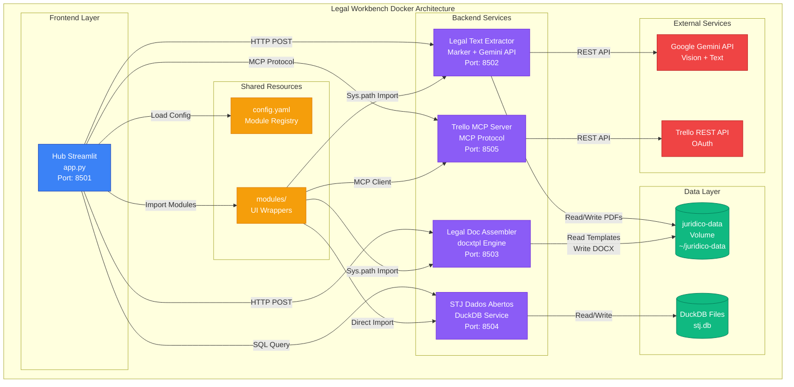
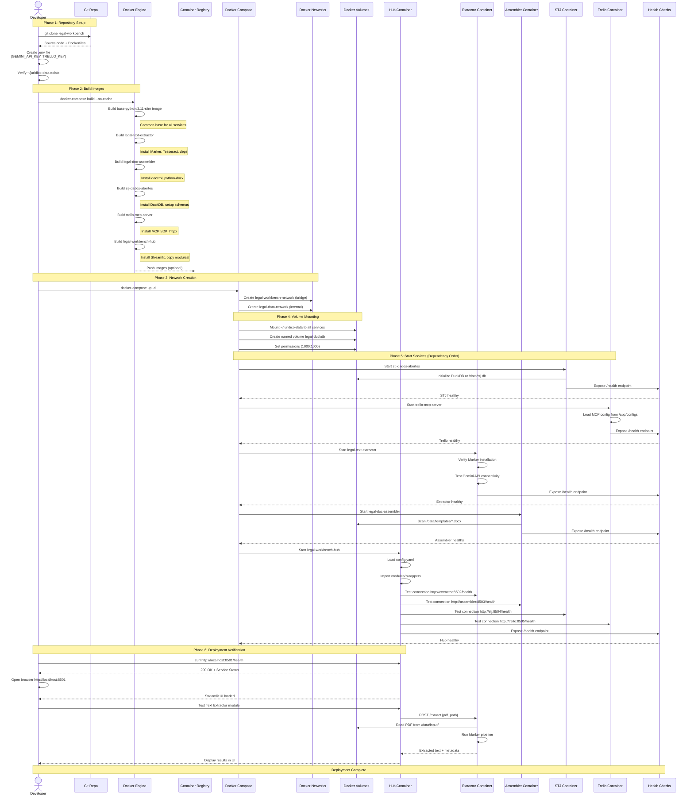
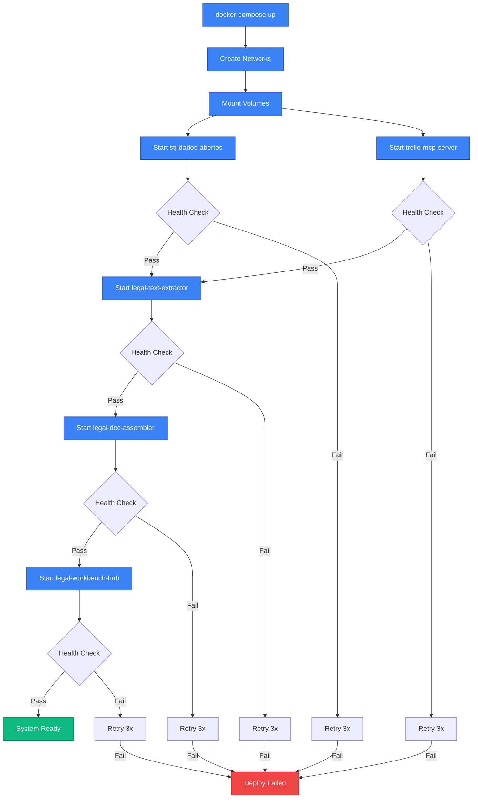
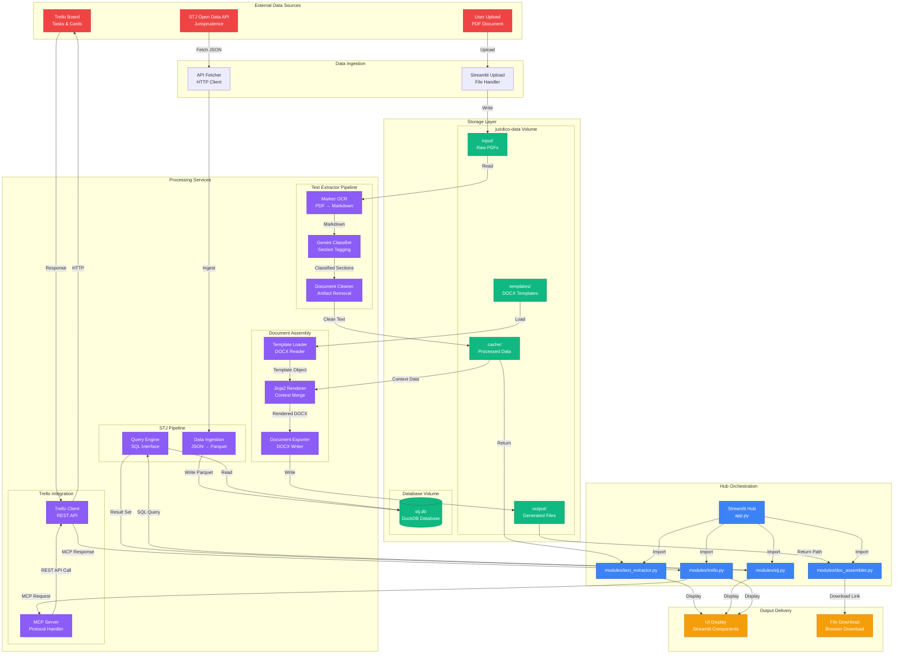
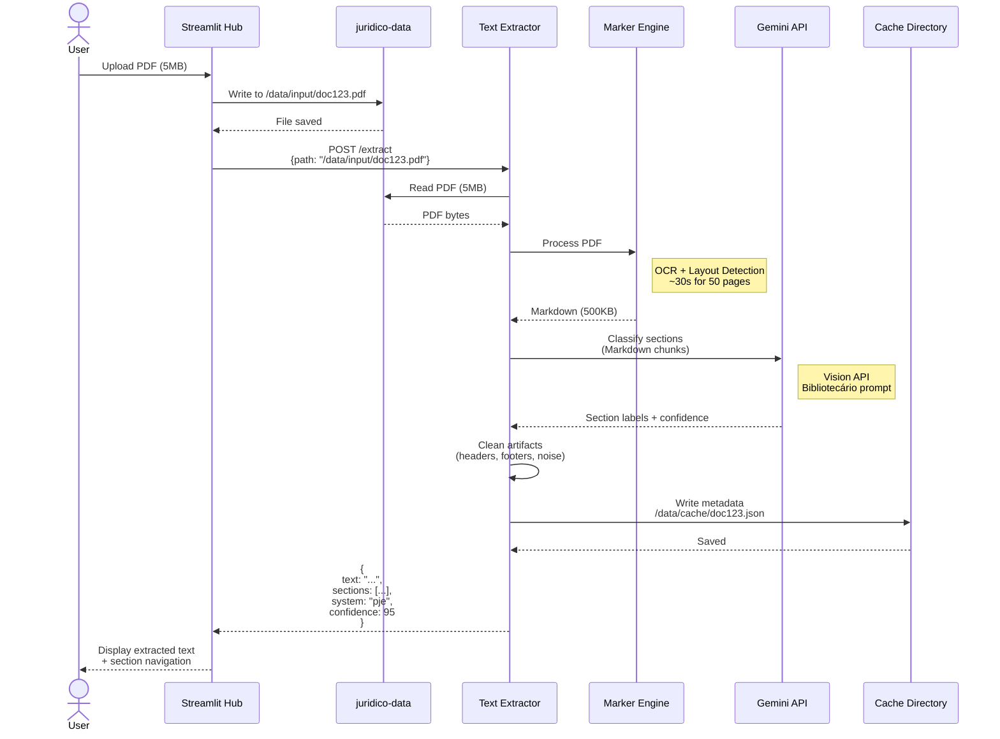
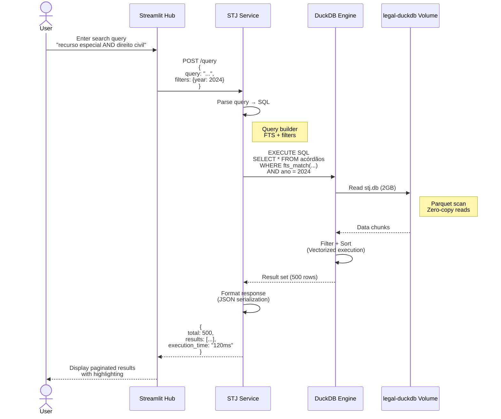
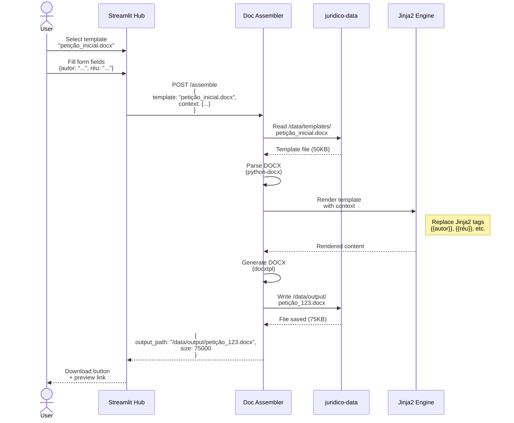

# Legal Workbench - Docker Workflow Diagrams

**Autor**: Pedro Giudice
**Data**: 2025-12-11
**Versão**: 1.0.0
**Status**: Draft

Este documento contém os diagramas do workflow de dockerização do Legal Workbench, mostrando a arquitetura de containers, deploy, fluxo de dados e topologia de rede.

---

## Índice

1. [Diagrama de Componentes](#1-diagrama-de-componentes)
2. [Diagrama de Deploy](#2-diagrama-de-deploy)
3. [Diagrama de Dados](#3-diagrama-de-dados)
4. [Diagrama de Rede](#4-diagrama-de-rede)
5. [Glossário](#glossário)
6. [Referências](#referências)

---

## 1. Diagrama de Componentes

Este diagrama mostra como os containers se comunicam entre si, suas dependências e interfaces expostas.



### Descrição dos Componentes

| Componente | Tipo | Porta | Descrição |
|------------|------|-------|-----------|
| **Hub Streamlit** | Frontend | 8501 | Entry point da aplicação. Interface web que orquestra todos os módulos |
| **Legal Text Extractor** | Backend | 8502 | Serviço de extração de texto usando Marker (OCR) + Gemini (classificação) |
| **Legal Doc Assembler** | Backend | 8503 | Serviço de montagem de documentos usando templates docxtpl |
| **STJ Dados Abertos** | Backend | 8504 | Serviço de consulta a dados abertos do STJ usando DuckDB |
| **Trello MCP Server** | Backend | 8505 | Servidor MCP para integração com Trello API |
| **juridico-data** | Volume | - | Volume persistente para PDFs, templates e outputs |
| **stj.db** | Volume | - | Banco DuckDB com dados do STJ |

---

## 2. Diagrama de Deploy

Este diagrama mostra a sequência completa de build e deploy dos containers.



### Ordem de Dependências



---

## 3. Diagrama de Dados

Este diagrama mostra o fluxo completo de dados através do sistema.



### Fluxos de Dados Detalhados

#### 1. Extração de Texto (PDF → Texto Limpo)



#### 2. Consulta STJ (Query → Resultado)



#### 3. Montagem de Documento (Template + Dados → DOCX)



---

## 4. Diagrama de Rede

Este diagrama mostra a topologia de rede completa do sistema.

```mermaid
graph TB
    subgraph "External Network (Internet)"
        BROWSER[User Browser<br/>HTTP/HTTPS]
        GEMINI_EXT[Gemini API<br/>generativelanguage.googleapis.com]
        TRELLO_EXT[Trello API<br/>api.trello.com]
    end

    subgraph "Host Network (Docker Host)"
        HOST_8501[localhost:8501<br/>→ hub:8501]
        HOST_8502[localhost:8502<br/>→ extractor:8502]
        HOST_8503[localhost:8503<br/>→ assembler:8503]
        HOST_8504[localhost:8504<br/>→ stj:8504]
        HOST_8505[localhost:8505<br/>→ trello:8505]

        HOST_VOL[~/juridico-data<br/>Host Volume]
    end

    subgraph "Docker Network: legal-workbench-network (Bridge)"
        subgraph "Hub Container"
            HUB_APP[Streamlit App<br/>EXPOSE 8501]
            HUB_VOL_MOUNT[/data → juridico-data]
        end

        subgraph "Extractor Container"
            EXT_APP[FastAPI App<br/>EXPOSE 8502]
            EXT_VOL_MOUNT[/data → juridico-data]
            EXT_MARKER[Marker Service<br/>Internal]
        end

        subgraph "Assembler Container"
            ASM_APP[FastAPI App<br/>EXPOSE 8503]
            ASM_VOL_MOUNT[/data → juridico-data]
            ASM_ENGINE[docxtpl Engine<br/>Internal]
        end

        subgraph "STJ Container"
            STJ_APP[FastAPI App<br/>EXPOSE 8504]
            STJ_VOL_MOUNT[/data → juridico-data]
            STJ_DUCK[DuckDB Engine<br/>Internal]
        end

        subgraph "Trello Container"
            TRL_APP[MCP Server<br/>EXPOSE 8505]
            TRL_CLIENT[HTTP Client<br/>Internal]
        end
    end

    subgraph "Docker Network: legal-data-network (Internal)"
        DATA_VOLUME[(juridico-data<br/>Volume)]
        DB_VOLUME[(legal-duckdb<br/>Volume)]
    end

    %% External Access
    BROWSER -->|HTTP| HOST_8501
    HOST_8501 -.->|Port Mapping| HUB_APP

    BROWSER -.->|Direct Debug| HOST_8502
    HOST_8502 -.->|Port Mapping| EXT_APP

    BROWSER -.->|Direct Debug| HOST_8503
    HOST_8503 -.->|Port Mapping| ASM_APP

    BROWSER -.->|Direct Debug| HOST_8504
    HOST_8504 -.->|Port Mapping| STJ_APP

    BROWSER -.->|Direct Debug| HOST_8505
    HOST_8505 -.->|Port Mapping| TRL_APP

    %% Container to Container (Bridge Network)
    HUB_APP -->|http://extractor:8502| EXT_APP
    HUB_APP -->|http://assembler:8503| ASM_APP
    HUB_APP -->|http://stj:8504| STJ_APP
    HUB_APP -->|http://trello:8505| TRL_APP

    %% Container to External APIs
    EXT_APP -->|HTTPS| GEMINI_EXT
    TRL_CLIENT -->|HTTPS| TRELLO_EXT

    %% Volume Mounts (Data Network)
    HUB_VOL_MOUNT -.->|Mount| DATA_VOLUME
    EXT_VOL_MOUNT -.->|Mount| DATA_VOLUME
    ASM_VOL_MOUNT -.->|Mount| DATA_VOLUME
    STJ_VOL_MOUNT -.->|Mount| DATA_VOLUME

    DATA_VOLUME -.->|Bind Mount| HOST_VOL
    STJ_DUCK -.->|Mount| DB_VOLUME

    %% Internal Services (No External Access)
    EXT_APP -->|localhost| EXT_MARKER
    ASM_APP -->|localhost| ASM_ENGINE
    STJ_APP -->|localhost| STJ_DUCK
    TRL_APP -->|localhost| TRL_CLIENT

    %% Styling
    classDef external fill:#ef4444,stroke:#b91c1c,color:#fff
    classDef host fill:#f59e0b,stroke:#d97706,color:#000
    classDef container fill:#3b82f6,stroke:#1e40af,color:#fff
    classDef internal fill:#8b5cf6,stroke:#6d28d9,color:#fff
    classDef volume fill:#10b981,stroke:#047857,color:#fff

    class BROWSER,GEMINI_EXT,TRELLO_EXT external
    class HOST_8501,HOST_8502,HOST_8503,HOST_8504,HOST_8505,HOST_VOL host
    class HUB_APP,EXT_APP,ASM_APP,STJ_APP,TRL_APP container
    class EXT_MARKER,ASM_ENGINE,STJ_DUCK,TRL_CLIENT internal
    class DATA_VOLUME,DB_VOLUME volume
```

### Configuração de Rede

#### 1. Bridge Network: `legal-workbench-network`

```yaml
networks:
  legal-workbench-network:
    driver: bridge
    ipam:
      config:
        - subnet: 172.28.0.0/16
          gateway: 172.28.0.1
```

**Características**:
- Permite comunicação entre containers via DNS interno
- Containers podem acessar internet para APIs externas
- Portas expostas são mapeadas para o host

**Resolução DNS Interna**:
- `extractor` → `172.28.0.2:8502`
- `assembler` → `172.28.0.3:8503`
- `stj` → `172.28.0.4:8504`
- `trello` → `172.28.0.5:8505`
- `hub` → `172.28.0.10:8501`

#### 2. Internal Network: `legal-data-network`

```yaml
networks:
  legal-data-network:
    driver: bridge
    internal: true  # No external access
```

**Características**:
- Rede isolada sem acesso à internet
- Usada apenas para comunicação com volumes de dados
- Maior segurança para dados sensíveis

#### 3. Port Mapping Table

| Service | Internal Port | Host Port | Protocol | Public |
|---------|--------------|-----------|----------|--------|
| Hub | 8501 | 8501 | HTTP | Yes (UI) |
| Extractor | 8502 | 8502 | HTTP | No (Debug only) |
| Assembler | 8503 | 8503 | HTTP | No (Debug only) |
| STJ | 8504 | 8504 | HTTP | No (Debug only) |
| Trello MCP | 8505 | 8505 | MCP/HTTP | No (Debug only) |

#### 4. Firewall Rules

```bash
# Allow only Hub to be publicly accessible
iptables -A INPUT -p tcp --dport 8501 -j ACCEPT

# Block direct access to backend services
iptables -A INPUT -p tcp --dport 8502:8505 -j DROP

# Allow internal Docker network communication
iptables -A FORWARD -i docker0 -o docker0 -j ACCEPT
```

---

## Glossário

| Termo | Descrição |
|-------|-----------|
| **Bridge Network** | Tipo de rede Docker que permite comunicação entre containers no mesmo host |
| **Internal Network** | Rede Docker isolada sem acesso à internet |
| **Volume Mount** | Mecanismo de persistência que mapeia diretórios entre host e container |
| **Health Check** | Verificação periódica de disponibilidade de um serviço |
| **MCP Protocol** | Model Context Protocol - protocolo para comunicação com LLMs |
| **DuckDB** | Banco de dados analítico embarcado, otimizado para OLAP |
| **Marker** | Engine de OCR otimizado para PDFs com layout complexo |
| **docxtpl** | Biblioteca Python para templating de documentos DOCX |
| **Streamlit** | Framework Python para criação de web apps de dados |

---

## Referências

### Documentação Oficial

- [Docker Compose Documentation](https://docs.docker.com/compose/)
- [Docker Networks](https://docs.docker.com/network/)
- [Docker Volumes](https://docs.docker.com/storage/volumes/)
- [Streamlit Documentation](https://docs.streamlit.io/)
- [DuckDB Documentation](https://duckdb.org/docs/)

### Arquivos Relacionados

- `/home/user/Claude-Code-Projetos/legal-workbench/CLAUDE.md` - Regras de desenvolvimento
- `/home/user/Claude-Code-Projetos/legal-workbench/config.yaml` - Configuração de módulos
- `/home/user/Claude-Code-Projetos/ARCHITECTURE.md` - Arquitetura geral do projeto
- `/home/user/Claude-Code-Projetos/docs/docker/` - Documentação Docker adicional

### Próximos Passos

1. Criar `docker-compose.yml` baseado nestes diagramas
2. Criar Dockerfiles individuais para cada serviço
3. Implementar health checks em cada container
4. Configurar CI/CD para build automatizado
5. Criar scripts de backup para volumes persistentes

---

**Última atualização**: 2025-12-11
**Autor**: Pedro Giudice (PGR)
**Versão do documento**: 1.0.0
